# week-1-day-3-assignment

- To run the code, clone the repository to your device and run the code on your terminal using "Start {filename.html}"

- These are the screenshots for the working code for both desktop and mobile view

- This is the output of the Layout Page: 
- Desktop View  
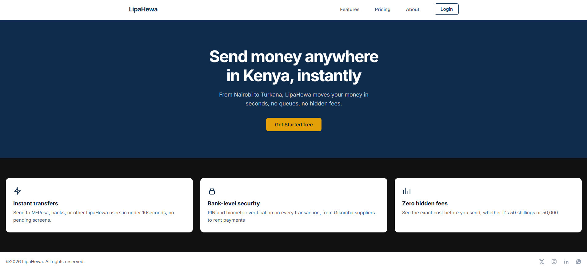

- Mobile View  
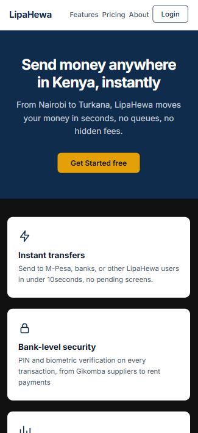
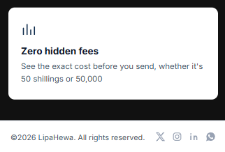

- This is the output of the Gallery Page: 
- Desktop View  
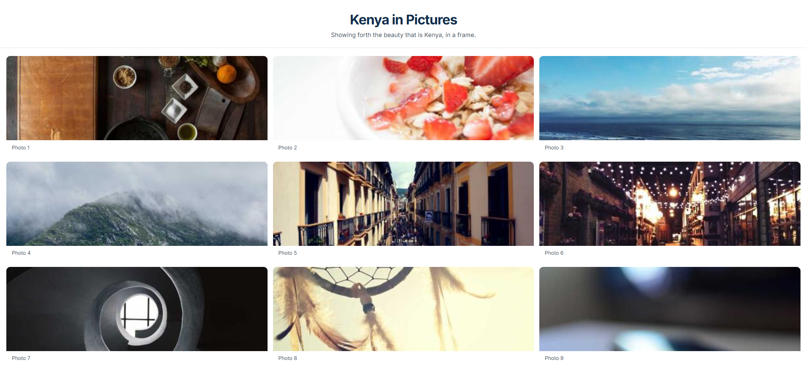

- Mobile View  
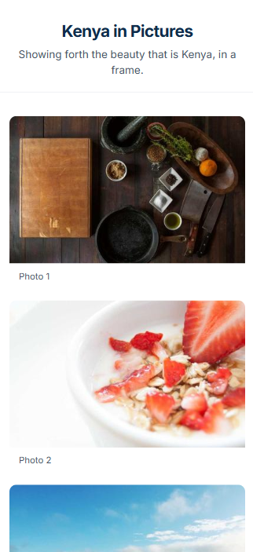
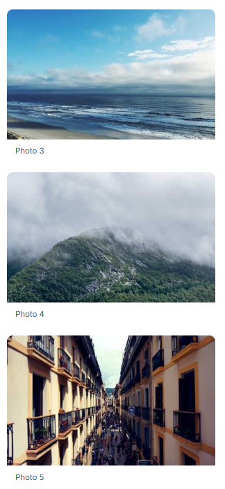
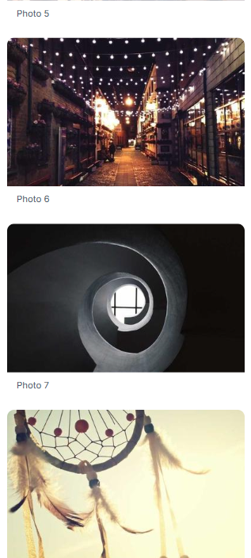
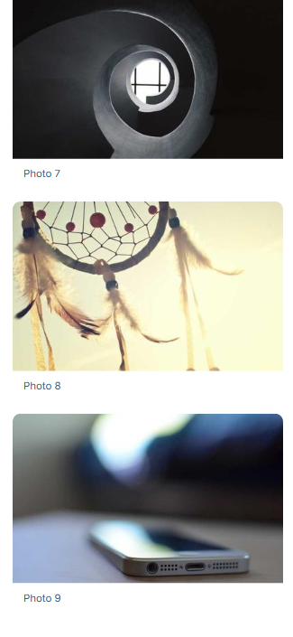

- This is the output of the Sticky-Nav Page: 
- Desktop View  
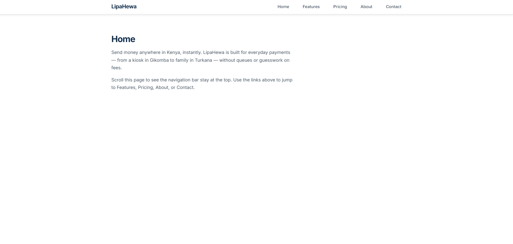
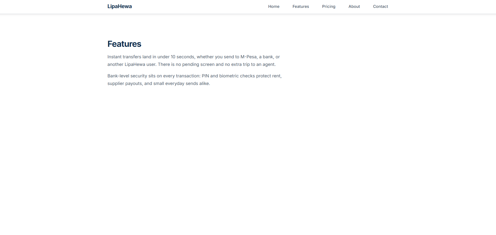
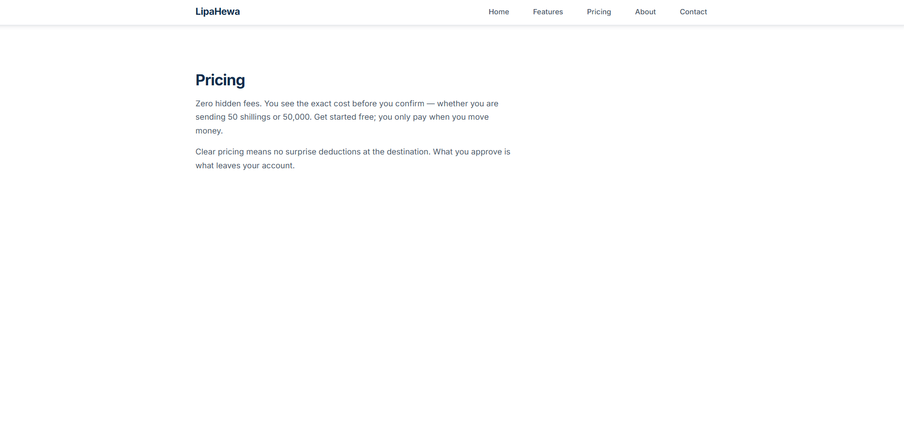
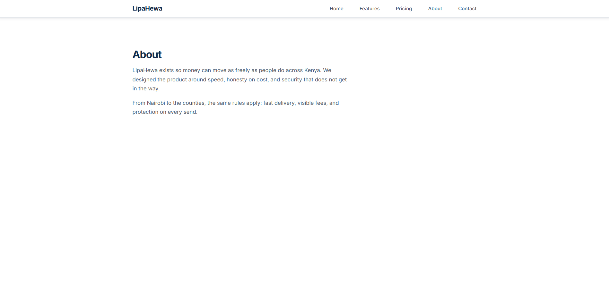
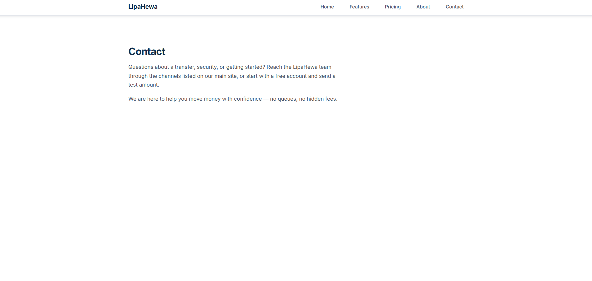
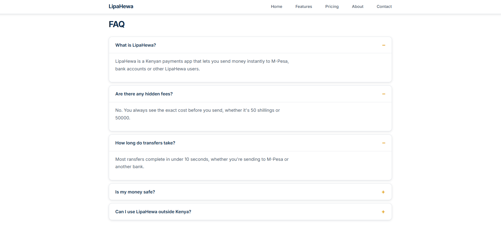

- Mobile View  
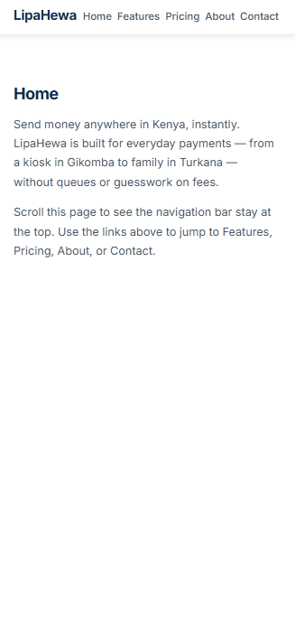
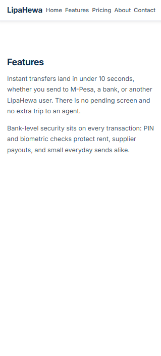
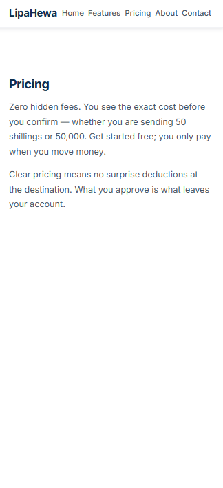
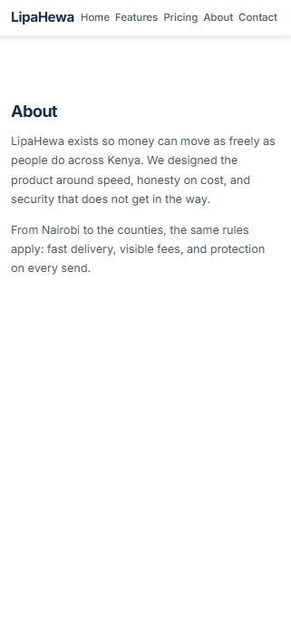
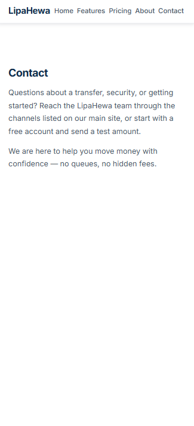
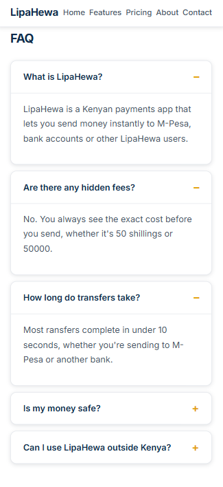